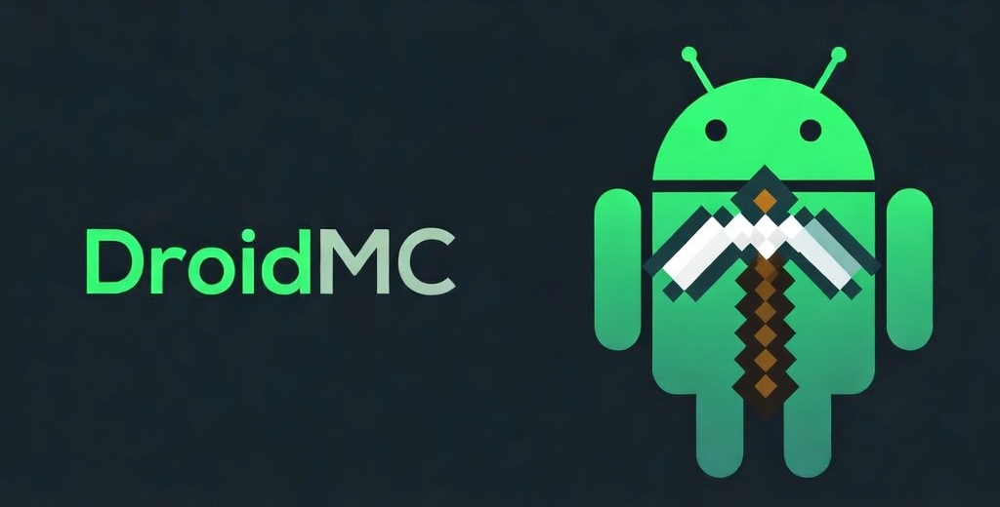

# DroidMC Beta

Maintained by Wafflebyte8-hue

Experimental development branch of DroidMC for faster updates, new features, and early fixes before they are promoted to stable.

DroidMC is a Minecraft server panel that runs directly on your Android phone through Termux. Control your server from any browser on the same WiFi.

[](https://discord.gg/u6tE8DzS5V)

---

## v3.1.2-beta.1

This beta branch ships new features and fixes ahead of the stable release line. It may change more often, but it is where active development happens first.

DroidMC v3 adds authentication, backups and restore, crash recovery, a file manager, validation tools, scheduled tasks, resource presets, HTTPS support, and a safer install/update flow.

---

## Beta Notice

This is the beta channel.

- New features land here first
- Fixes usually arrive here before stable
- Stable features are promoted from beta after testing
- Some builds may change quickly between releases

If you want the newest DroidMC features first, use beta.  
If you want the slower release track, use stable.

---

## First, update Termux packages

```bash
pkg update && pkg upgrade -y
```

## Install

Paste this in Termux:

```bash
curl -fsSL https://raw.githubusercontent.com/wafflebyte8-hue/Droidmc-Beta/main/setup.sh -o setup.sh
bash setup.sh
```

The setup script will:

- Download DroidMC into a temporary folder first
- Verify downloaded files with `checksums.sha256`
- Warn instead of halting if checksum verification fails
- Back up panel files before updates
- Ask whether to keep existing config and auth on reinstall
- Prompt you to create the web panel username and password on the phone
- Optionally generate a self-signed HTTPS certificate for the panel
- Detect your RAM and suggest a server allocation
- Install Java, Node.js, OpenSSL tools, and optionally tmux

Then start the panel:

```bash
~/start-mc.sh
~/start-mc-bg.sh
```

Open in your browser:

- Same device: `http://localhost:8080`
- Same WiFi: `http://your_phone_ip:8080`

If you enable HTTPS during setup, use:

- Same device: `https://localhost:8443`
- Same WiFi: `https://your_phone_ip:8443`

---

## Update

Rerun the setup script:

```bash
bash setup.sh
```

The updater preserves world data, can preserve existing config and auth, and creates a backup of current panel files before overwriting them.

---

## Uninstall

`uninstall.sh` is downloaded automatically during setup:

```bash
~/uninstall-mc.sh
```

You will be asked whether to keep or delete world data before anything is removed.

---

## Beta Highlights

- Web panel authentication
- Optional self-signed HTTPS certificate support
- Login, logout, and in-panel credential changes
- Crash detection with `crash.log`
- Automatic restart after crashes
- Manual backups, restore, delete, and retention
- Scheduled backups
- Scheduled broadcast messages
- Scheduled daily restarts
- Resource presets
- Offline whitelist, ops, and bans management
- Managed file editor for core server files
- File visibility for plugins, mods, datapacks, and logs
- Validation screen for Java, Node, RAM, auth, tmux, wake-lock, and jar presence
- Safer install/update flow with staged downloads and checksum verification

---

## Beta Features

- Purpur install support
- Bedrock-target Nukkit install support
- Cross-platform install helper for Geyser + Floodgate
- Duckdns

---

## Features

- **Server control** - Start, stop, restart, and force kill
- **Live console** - Stream logs in real time and send commands
- **Crash recovery** - Detect crashes, write `crash.log`, and restart automatically
- **Backups** - Create, restore, and manage backups from the panel
- **Version manager** - Download Paper, Purpur, Vanilla, Fabric, Forge, NeoForge, Quilt, and Nukkit
- **Checksum tracking** - Store hashes for downloaded or uploaded files
- **Player management** - Kick, ban, unban, OP, gamemode, teleport, heal, and feed
- **Offline admin tools** - Manage whitelist, operators, and bans without the server running
- **Plugins and mods** - Upload and delete `.jar` files
- **File manager** - Read and edit key files like `server.properties`, `ops.json`, and logs
- **Properties editor** - Edit `server.properties` from the browser
- **System stats** - Live CPU, RAM, and disk usage
- **Validation tools** - Check runtime health and install prerequisites
- **How to connect** - See IP, port, server type, and version

---

## Requirements

- Android device running Termux
- 2 GB RAM minimum recommended
- 4 GB or more for a smoother experience
- Enough storage for Java, server files, worlds, and backups

The setup script installs:

- OpenJDK 21
- Node.js
- curl
- OpenSSL tools
- tmux (optional)

---

## Tips

- Keep your phone plugged in while the server runs
- Use `termux-wake-lock` to reduce Android background kills
- Use Paper or Purpur over Vanilla when possible for better ARM performance
- Lower `view-distance` and `simulation-distance` on weaker devices
- Use the validation tab after setup to confirm Java, auth, tmux, HTTPS, and jar status

---

## File structure

```text
~/DroidMC/
├── server.js           # Backend and API
├── package.json        # Node dependencies
├── package-lock.json   # Locked dependency versions
├── config.json         # Panel and server settings
├── auth.json           # Panel login credentials
├── integrity.json      # Saved file hashes
├── .checksums          # Installer checksum manifest
├── .version            # Installed DroidMC version
├── .backup/            # Backups of previous panel files
├── backups/            # Server backups created from the panel
├── certs/              # Optional HTTPS certificate and key
├── node_modules/
└── public/
    ├── index.html
    ├── style.css
    └── app.js
```

---

## Security

- The panel binds to `0.0.0.0` so devices on your local network can reach it
- Authentication is enabled in v3 and created during setup
- HTTPS can be enabled with a self-signed certificate during setup
- A self-signed certificate encrypts traffic but still shows a browser trust warning
- Do not port-forward the panel unless you know exactly what you are doing
- Session login is browser-based and currently stored in memory by the panel process

---

## Notes

- Beta builds may update more frequently than stable
- If you change distributed files, regenerate `checksums.sha256` before release
- If checksum verification fails after a release, verify LF line endings and push all changed files together
